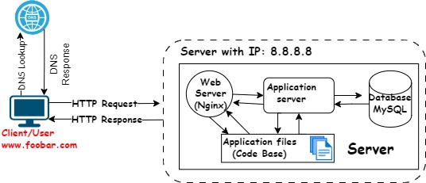

# Simple Web Stack

[Visit Board](https://app.diagrams.net/#G1As8oHbDES4NBW3hmfLDZvAijeAe1tP8B)

## Description

This is a simple web infrastructure that hosts a website that is reachable via `www.foobar.com`. There are no firewalls or SSL certificates for protecting the server's network. Each component (database, application server) has to share the resources (CPU, RAM, and SSD) provided by the server.

## Specifics About This Infrastructure

- What a server is. A server is a computer that stores and shares data, serving requests from other computers. It is generally located in a data centre and it can be physical or virtual. It runs a operating system.

- The role of the domain name. The domain name directs users to a specific server's IP address, facilitating easy access to websites. To provide a human-friendly alias for an IP Address. The IP address and domain name alias is mapped in the Domain Name System (DNS)

- The type of DNS record `www` is in `www.foobar.com`. `www.foobar.com` uses an **A record**. This can be checked by running `dig www.foobar.com`. **Note:** the results might be different but for the infrastructure in this design, an **A** record is used. 
  <i>Address Mapping record (A Record)—also known as a DNS host record, stores a hostname and its corresponding IPv4 address.</i>

- The role of the web server. The web server handles HTTP requests, serving web pages to users(static content).

- The role of the application server. The application server processes dynamic content and executes application logic.

- The role of the database. The database stores and retrieves data for the application.

- What the server uses to communicate with the client (computer of the user requesting the website). The server communicates with the user's computer using protocols like HTTP. Communication between the client and the server occurs over the internet network through the TCP/IP protocol suite.

## Issues With This Infrastructure

- SPOF (Single Point of Failure):  A single component failure can disrupt the entire system. This server is a single point of failure because nothing is redundant.

- Downtime when maintenance needed. Downtime during maintenance, such as restarting the web server for deploying new code, interrupts service.

- Cannot scale if there's too much incoming traffic. It would be hard to scale this infrastructure becauses one server contains the required components. The server can quickly run out of resources or slow down when it starts receiving a lot of requests.
