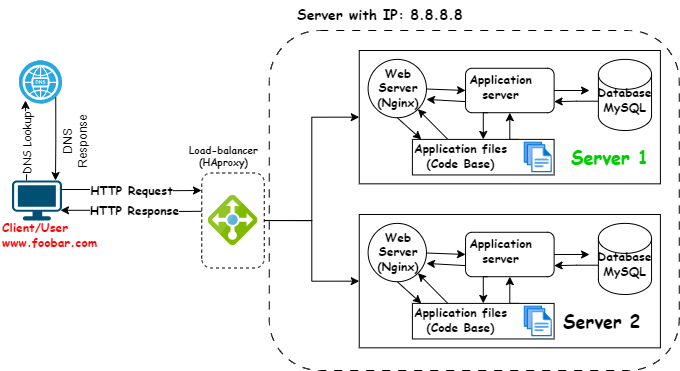

# Distributed Web Infrastructure

[Visit Board](https://app.diagrams.net/#G1o7U53w743bDRN2PbkMsHR7x0nrLH5sTl)

## Description

This is a distributed web infrastructure that atttempts to reduce the traffic to the primary server by distributing some of the load to a replica server with the aid of a server responsible for balancing the load between the two servers (primary and replica). Additional elements are added to enhance system capacity, improve performance, and ensure redundancy for reliability.

## Specifics About This Infrastructure

- The distribution algorithm the load balancer is configured with and how it works. The HAProxy load balancer uses a distribution algorithm, like Round Robin or Least Connections, to evenly distribute incoming traffic among multiple servers. It is added to distribute traffic between 2 servers (or failover)
- The setup enabled by the load-balancer. The HAProxy load balancer can enable an Active-Active setup, where all servers are actively handling traffic, or an Active-Passive setup, where only one server is active while others remain on standby.
- How a database _Primary-Replica_ (_Master-Slave_) cluster works. In a Primary-Replica (Master-Slave) database cluster, the Primary node processes write operations, while the Replica nodes replicate the data and handle read operations. This cluster uses replication to keep data synchronized.
- The difference between the _Primary_ node and the _Replica_ node in regard to the application. The Primary node is responsible for write operations and updating the database, while the Replica nodes are used for reading data, providing fault tolerance, and scaling the read capacity.

## Issues With This Infrastructure

- There are multiple SPOF (Single Point Of Failure). Single Point of Failure (SPOF) can still exist if critical components lack redundancy. The server containing the load balancer and the application server connecting to the primary database server are also SPOFs. 
- Security issues. The data transmitted over the network isn't encrypted using an SSL certificate so hackers can spy on the network. There is no way of blocking unauthorized IPs since there's no firewall installed on any server.
- No monitoring. Lack of monitoring can lead to difficulties in identifying and addressing performance issues, potential outages, or security breaches.