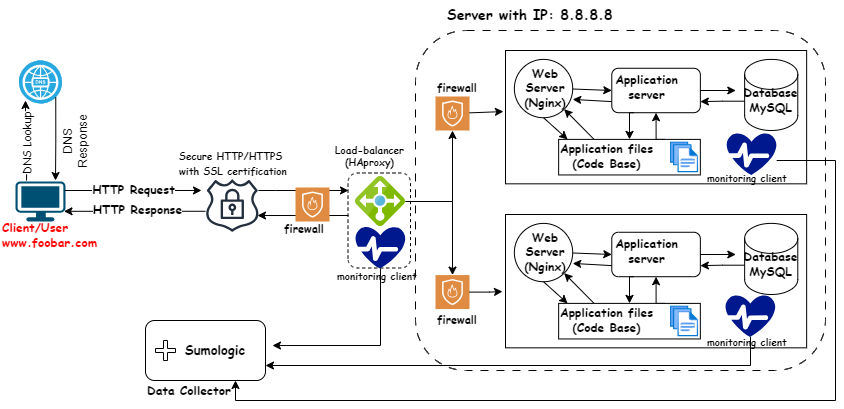

# Secured and Monitored Web Infrastructure

[Visit Board](https://app.diagrams.net/#G1eCwYoUKM1sdYwFS13wtQf-iPDdNg-IXX)

## Description

This is a 3-server web infrastructure that is secured, monitored, and serves encrypted traffic. Additional elements are added to improve system performance, scalability, and redundancy, ensuring efficient and reliable operations.

## Specifics About This Infrastructure

- The purpose of the firewalls. Firewalls are used to control and filter incoming and outgoing network traffic, enhancing security by preventing unauthorized access and potential threats.
- The purpose of the SSL certificate. The SSL certificate is for encrypting the traffic between the web servers and the external network to prevent man-in-the-middle attacks (MITM) and network sniffers from sniffing the traffic which could expose valuable information. The SSL certs ensure privacy, integrity, and identification.
- The purpose of the monitoring clients. Monitoring is used to observe and track system performance, identify issues, and ensure optimal operation, helping to prevent and address problems proactively. Monitoring tools collect data by periodically checking system metrics, logs, and performance indicators to provide insights into the health and behavior of the infrastructure. To monitor web server QPS (Queries Per Second), you can use tools like Prometheus or Grafana, setting up metrics collection and creating dashboards for real-time insights issues.

## Issues With This Infrastructure

- Terminating SSL at the load balancer level would leave the traffic between the load balancer and the web servers unencrypted.
- Having one MySQL server is an issue because it is not scalable and can act as a single point of failure for the web infrastructure.
- Having servers with all the same components would make the components contend for resources on the server like CPU, Memory, I/O, etc., which can lead to poor performance and also make it difficult to locate the source of the problem. A setup such as this is not easily scalable.
