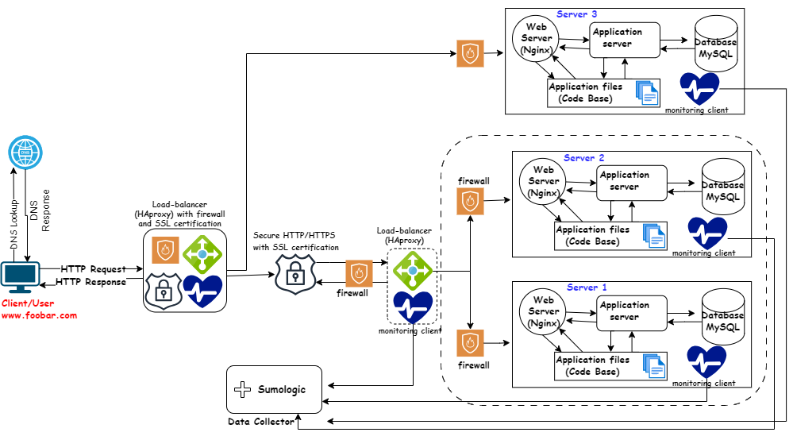

# Scaled Up Web Infrastructure

[Visit Board](https://app.diagrams.net/#G1w6--OQduZZvPY0vNbegC6fDrjU68-0MU)

## Description

This web infrastructure is a scaled up version of the infrastructure described [here](2-secured_and_monitored_web_infrastructure.md). In this version, all SPOFs have been removed and each of the major components (web server, application server, and database servers) have been moved to separate GNU/Linux servers. The SSL protection isn't terminated at the load-balancer and each server's network is protected with a firewall and they're also monitored.

## Specifics About This Infrastructure

- The addition of a firewall between each server. This protects each server from unwanted and unauthorized users rather than protecting a single server.
- Adding one server provides the basic infrastructure to host and serve applications or content.
- A load balancer (HAproxy) configured as a cluster with another one is added for load distribution, improving performance and ensuring high availability by balancing traffic between multiple servers.
- Splitting components (web server, application server, database) with their own server is done for better resource management, scalability, and fault isolation, allowing each component to operate independently and efficiently.

## Issues With This Infrastructure

- High maintenance costs. Moving each of the major components to its own server, means that more servers would have to be bought and the company's electricity bill would rise along with the introduction of new servers. Some of the company's funds would have to be used to buy the servers and pay for the electricity consumption needed to keep the servers (including the new and old ones) running.
